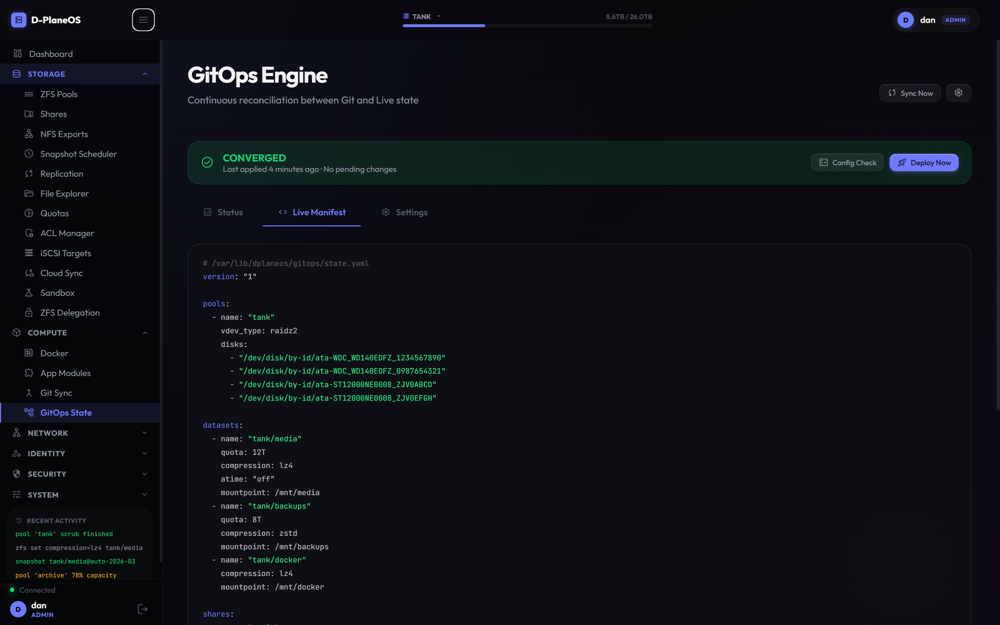

# DPlaneOS

A ZFS-first storage operating system for homelab and small-office NAS deployments. Single Go daemon, PostgreSQL state, React UI, NixOS appliance. Declarative from the OS down to the dataset.

[](https://github.com/4nonX/DPlaneOS/releases/latest)
[](https://github.com/4nonX/DPlaneOS/blob/main/LICENSE)
[](https://github.com/4nonX/DPlaneOS/blob/main/nixos/README.md)
[](https://github.com/4nonX/DPlaneOS/actions)

[](https://dplane.d-net.me/demo.html)

*Click the screenshot for an interactive tour of the UI.*

---

## Project status

Read this before you deploy anything.

DPlaneOS is built and maintained by one person (hi, [Dan](https://github.com/4nonX)). It runs in my own homelab on roughly 33 TB across 60+ services and has done so reliably for months, which is the entire production deployment base I can point to. If you need vendor support, a roadmap committee, or a phone number to call at 3am, this is not the project for you. Yet.

Feature maturity, honestly:

| Area | Status | Notes |
|------|--------|-------|
| ZFS pool / dataset / snapshot management | Stable | The core. Used daily. |
| SMB, NFS, iSCSI sharing | Stable | Samba + kernel NFS + LIO. |
| Container management (Docker, Compose) | Stable | Including ZFS-clone sandboxes. |
| Hot-swap detection and auto-import | Stable | udev + ZED, exercised regularly. |
| LDAP / Active Directory integration | Beta | Works, less battle-tested than local auth. |
| A/B OTA updates with auto-revert | Beta | Mechanism is sound, sample size is small. |
| GitOps reconciliation | Beta | Bi-directional sync works; edge cases still surfacing. |
| PostgreSQL HA (Patroni + etcd) | Experimental | Tested in lab, never under real load. |
| Replicated-topology HA with witness | Experimental | Same. Read the [Showstopper Mitigation Guide](docs/reference/SHOWSTOPPER-MITIGATION-GUIDE.md) first. |
| Shared-SAS HA with SCSI-3 PR fencing | Experimental | Tested on one hardware configuration. Yours will differ. |
| NVMe-oF over TCP | Experimental | Functional, not yet stress-tested. |

If you're considering this for anything beyond a homelab, also read the [Threat Model](docs/reference/THREAT-MODEL.md) (13 scenarios, known gaps documented) and the [Non-ECC RAM Warning](docs/hardware/NON-ECC-WARNING.md).

Bug reports are welcome. So are contributors; the [CLA](docs/legal/CLA-INDIVIDUAL.md) is upfront about copyright assignment, which some people will not be comfortable with. Fair.

---

## What it does

| Area | Capabilities |
|------|-------------|
| **Storage** | ZFS pools, datasets, snapshots, `zfs send` replication, native encryption, quotas, S.M.A.R.T., POSIX ACLs, file explorer with chunked uploads |
| **Hot-swap** | udev detects disk add/remove; daemon auto-imports FAULTED/UNAVAIL pools and suggests vdev replacements in the UI |
| **Sharing** | SMB (with Time Machine via `vfs_fruit`), NFS, iSCSI, configured from the UI |
| **Containers** | Docker, Compose stacks, template library, ephemeral ZFS-clone sandboxes, atomic updates with rollback |
| **Network** | Interface config, bonding, VLANs, routing, DNS |
| **Identity** | Local users, LDAP / AD with group-to-role mapping, TOTP 2FA, API tokens |
| **Security** | RBAC (4 roles, 34 permissions), HMAC audit chain, CSRF protection, firewall, TLS, allowlist-validated exec calls |
| **System** | Dashboard, logs, UPS (NUT), IPMI / sensors, hardware auto-tuning, cloud sync (rclone), HA node monitoring |
| **GitOps** | Git-sync repositories, bi-directional reconciliation, drift detection |

---

## Install

Boot the installer ISO. It handles everything.

```bash
# Write the ISO to USB (Linux/macOS)
dd if=dplaneos-v*.iso of=/dev/sdX bs=4M status=progress conv=fsync
```

1. Boot the target machine from USB.
2. The installer launches automatically. Enter disk, hostname, SSH key.
3. DPlaneOS installs and starts within minutes.
4. Open `http://<your-server-ip>/`. Change the admin password on first login.

**Download:** [Latest release](https://github.com/4nonX/DPlaneOS/releases/latest). Grab `dplaneos-v*-installer-amd64.iso` (x86_64) or `...-arm64.iso` (aarch64, including Raspberry Pi 5). The combined installer handles NAS installation and, for replicated-topology HA clusters, witness-node installation via a boot menu. Shared-SAS clusters need only the two data-node ISOs.

**Offline / air-gapped:** the ISO contains the complete NixOS closure. No internet access needed during installation.

**Rebuilding from source:** `nix build .#iso`. See [nixos/README.md](nixos/README.md).

### Minimum hardware

- 64-bit CPU, x86_64 or aarch64 (Raspberry Pi 5 supported)
- 8 GB RAM minimum, 16 GB recommended, more for large pools
- ECC RAM strongly recommended for ZFS; non-ECC is supported but read the [warning](docs/hardware/NON-ECC-WARNING.md) first
- One disk for the OS, plus the disks you intend to pool
- Full compatibility list: [Hardware Compatibility](docs/hardware/HARDWARE-COMPATIBILITY.md)

---

## Architecture

The runtime is a single statically-linked Go daemon (`dplaned`) sitting behind nginx, with PostgreSQL for state. The daemon talks to ZFS, Docker, and the kernel via `exec.Command` with a strict allowlist (no shell, no string interpolation). The frontend is a pre-built React 19 bundle served as static files.

```
Browser
  └── nginx :80/:443          static files from /opt/dplaneos/app/
        └── proxy /api/ /ws/
              └── dplaned :9000 (Go)
                    ├── PostgreSQL /var/lib/dplaneos/pgsql/ (embedded or Patroni-managed)
                    ├── ZFS     kernel module via allowlisted exec
                    ├── Docker  socket
                    └── LDAP/AD optional
```

| Component | Detail |
|-----------|--------|
| Frontend | React 19 + TypeScript + Vite, pre-built, no Node.js at runtime |
| Backend | Go daemon, allowlist-validated exec, no shell invocation anywhere in the codebase |
| Database | PostgreSQL 15+ (Patroni for HA topologies) |
| Auth | bcrypt (local accounts), LDAP bind (directory accounts), TOTP 2FA, 32-byte session tokens, CSRF double-submit |
| ZFS events | ZED hook delivers pool fault, scrub, and resilver events in real time |

Deeper reading: [Architecture](docs/reference/ARCHITECTURE.md), [Design Philosophy](docs/reference/PHILOSOPHY.md), [NixOS Rationale](docs/reference/NIXOS-RATIONALE.md).

---

## Key paths

| Item | Path |
|------|------|
| Daemon binary | `/opt/dplaneos/daemon/dplaned` |
| Web UI (static) | `/opt/dplaneos/app/` |
| Version file | `/opt/dplaneos/VERSION` |
| Database state | `/var/lib/dplaneos/pgsql/` |
| DB configuration | `/etc/dplaneos/patroni.yaml` |
| Custom container icons | `/var/lib/dplaneos/custom_icons/` |
| Logs | `/var/log/dplaneos/` |
| ZED hook | `/etc/zfs/zed.d/dplaneos-notify.sh` |

---

## Quick command reference

```bash
# Service control
sudo systemctl status dplaned
sudo systemctl restart dplaned
sudo journalctl -u dplaned -f

# Health check
curl http://127.0.0.1:9000/health

# Interactive recovery (locked out, DB issues, ZFS problems)
sudo dplaneos-recovery

# Database access
sudo -u postgres psql dplaneos -c "\dt"

# ZFS
zpool status
zpool import

# OTA upgrade
sudo dplaneos-ota-update
```

---

## Documentation

### Installation and operation

| Document | What it covers |
|----------|---------------|
| [Installation Guide](docs/admin/INSTALLATION-GUIDE.md) | Requirements, ISO install flow, post-install checklist, OTA upgrades |
| [NixOS Install Guide](nixos/NIXOS-INSTALL-GUIDE.md) | For NixOS beginners: empty hardware to running NAS |
| [Administrator Guide](docs/admin/ADMIN-GUIDE.md) | Users, roles, permissions, storage, containers, LDAP/AD, security |
| [Backup and Replication](docs/admin/BACKUP-REPLICATION.md) | Snapshots, ZFS send/receive, cloud sync, cold tier, rsync, DB backup, recovery |
| [High Availability](docs/admin/HIGH-AVAILABILITY.md) | Shared-SAS with SCSI-3 PR fencing, replicated ZFS with witness, Patroni, Keepalived, STONITH, rolling upgrades |
| [OTA Updates](docs/admin/OTA-UPDATES.md) | A/B slots, health check, auto-revert, manual rollback, HA rolling upgrades |
| [Optional Protocols](docs/admin/OPTIONAL-PROTOCOLS.md) | iSCSI, NVMe-oF, FTP/FTPS, MinIO S3-compatible object store |
| [Alerts and Authentication](docs/admin/ALERTS.md) | SMTP, webhook, Telegram alerting, TOTP 2FA setup and backup codes |
| [Troubleshooting](docs/admin/TROUBLESHOOTING.md) | Build failures, ZFS issues, DB init race, Docker behind proxy, ZED setup |
| [Recovery Guide](docs/admin/RECOVERY.md) | Service management, DB restore, admin lockout, ZFS recovery, hot-swap, rollback |

### Reference

| Document | What it covers |
|----------|---------------|
| [Pitch](PITCH.md) | Git as control plane: the enterprise and fleet case |
| [Design Philosophy](docs/reference/PHILOSOPHY.md) | Four core principles, design decisions, tradeoffs |
| [Architecture](docs/reference/ARCHITECTURE.md) | Three-layer model, persistence, single-node and HA architecture |
| [GitOps Reference](docs/reference/GITOPS-REFERENCE.md) | `state.yaml` format, reconciliation engine, drift detection, Capture workflow |
| [Changelog](docs/reference/CHANGELOG.md) | Full version history |
| [Error Reference](docs/reference/ERROR-REFERENCE.md) | Every HTTP error code the API returns, with cause and fix |
| [NixOS Rationale](docs/reference/NIXOS-RATIONALE.md) | Why DPlaneOS is NixOS-exclusive |
| [Porting Guide](docs/reference/PORTING-GUIDE.md) | Forking for other Linux distributions: what it takes, what you lose |
| [Showstopper Mitigation Guide](docs/reference/SHOWSTOPPER-MITIGATION-GUIDE.md) | Honest assessment of HA limits, binary trust, resolved vs open issues |
| [Threat Model](docs/reference/THREAT-MODEL.md) | Security architecture, 13 threat scenarios, mitigations, residual risks, known gaps |
| [Dependencies](docs/reference/DEPENDENCIES.md) | Bundled Go and frontend deps, system requirements, build instructions |

### Hardware

| Document | What it covers |
|----------|---------------|
| [Hardware Compatibility](docs/hardware/HARDWARE-COMPATIBILITY.md) | CPUs, RAM, disk types, network, RAID controllers, auto-tuning |
| [Non-ECC RAM Warning](docs/hardware/NON-ECC-WARNING.md) | Why ZFS plus non-ECC is risky, probability analysis, mitigations |

### NixOS

| Document | What it covers |
|----------|---------------|
| [NixOS Overview](nixos/README.md) | ISO, Flake, and standalone install paths |
| [NixOS Install Guide](nixos/NIXOS-INSTALL-GUIDE.md) | Step-by-step for beginners |
| [NixOS Technical Reference](nixos/NIXOS-README.md) | Declarative config, rollback, licensing, advanced options |

### Development

| Document | What it covers |
|----------|---------------|
| [Contributing](CONTRIBUTING.md) | Dev setup, project structure, coding conventions, security requirements for PRs |
| [Codebase Diagram](docs/development/CODEBASE-DIAGRAM.md) | Mermaid diagrams: system overview, daemon internals, request lifecycle, disk events, auth flow |
| [Release Workflow](.agents/workflows/release.md) | Version bump, build, tag, and push sequence |

### Legal

| Document | What it covers |
|----------|---------------|
| [License](LICENSE) | GNU Affero General Public License v3.0 |
| [Security Policy](SECURITY.md) | Vulnerability reporting, safe harbour, supported versions |
| [Individual CLA](docs/legal/CLA-INDIVIDUAL.md) | Contributor license agreement for individuals |
| [Entity CLA](docs/legal/CLA-ENTITY.md) | Contributor license agreement for organisations |
| [PostgreSQL Migration Guide](MIGRATION.md) | Upgrading from SQLite to PostgreSQL (v7.0.0) |

---

## License

[GNU Affero General Public License v3.0](https://www.gnu.org/licenses/agpl-3.0.html)
