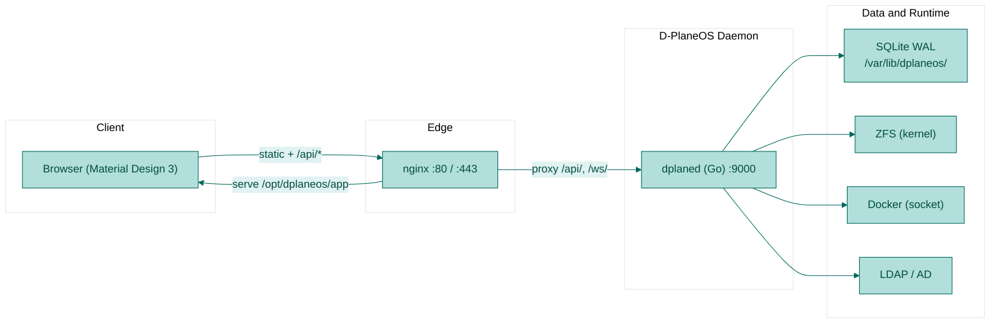
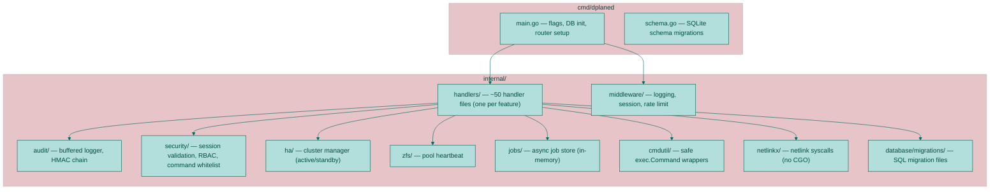
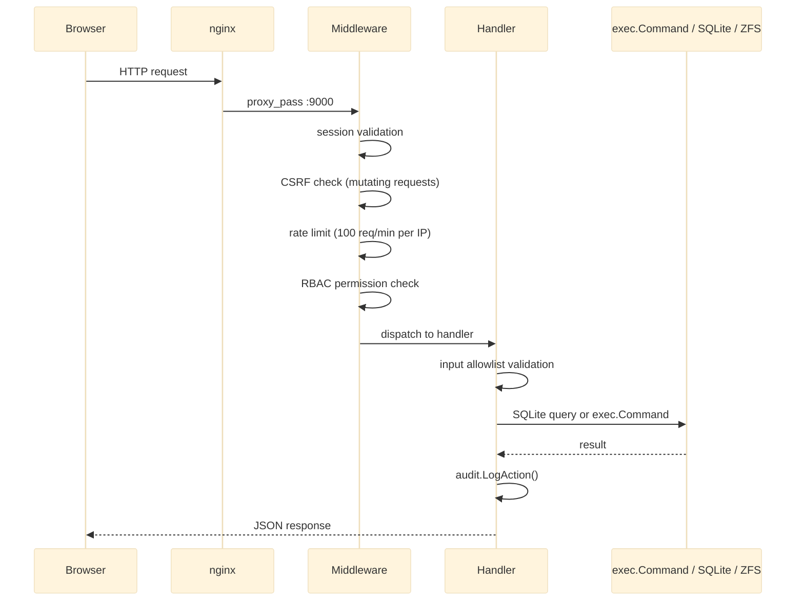
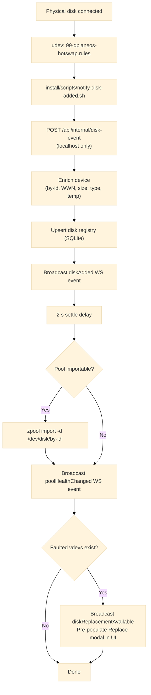
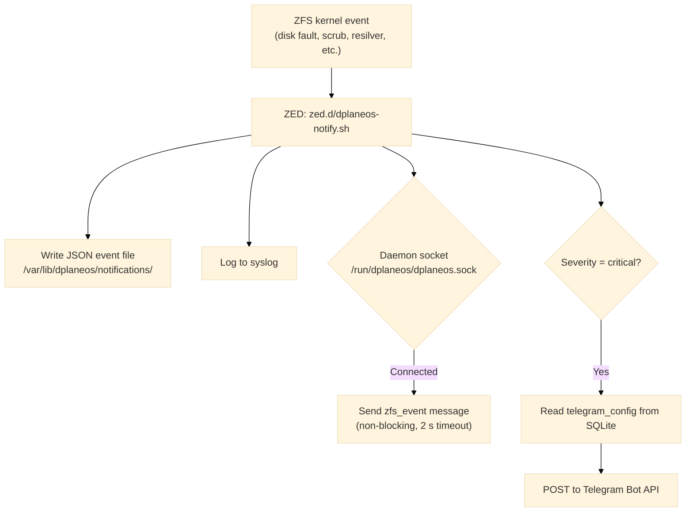
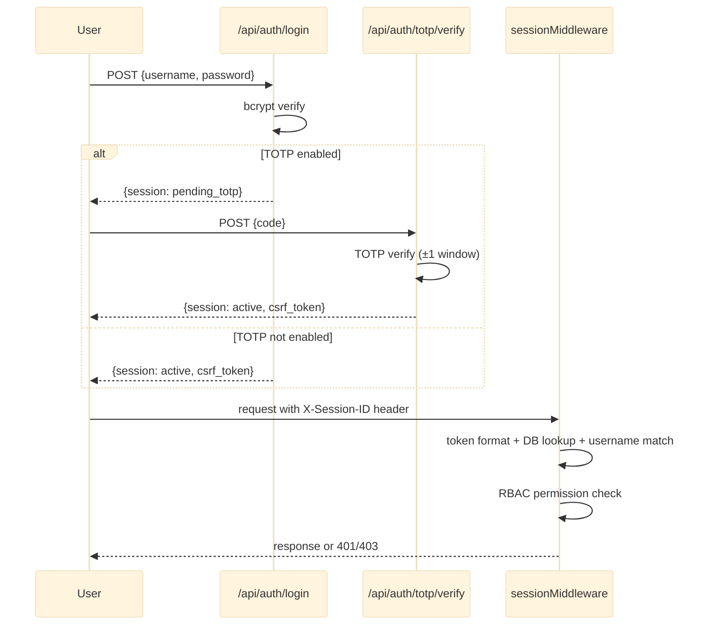

# D-PlaneOS — Architecture Diagrams

Visual overview of the codebase. Render in any Mermaid-compatible viewer (GitHub, VS Code with Mermaid extension, or [mermaid.live](https://mermaid.live)).

---

## System Overview

---

## Daemon Internal Structure (Go)

---

## Request Lifecycle

---

## Disk Event Flow (Hot-Swap)

---

## ZED Hook Flow

---

## Authentication Flow

